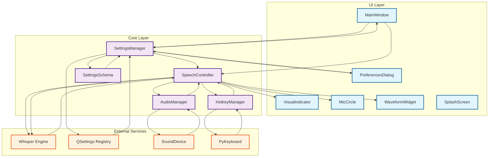
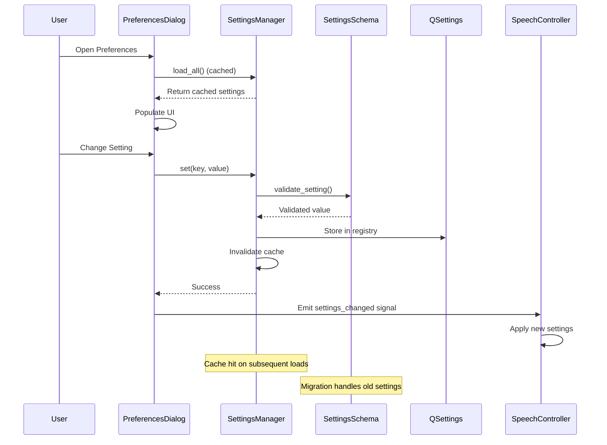
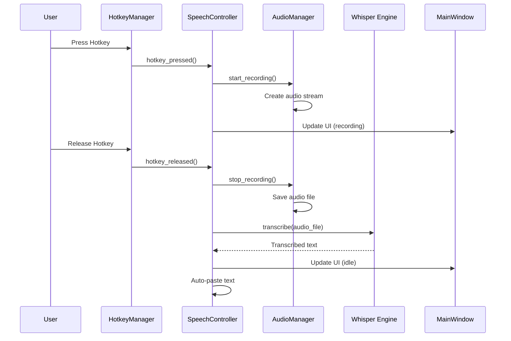

# Whiz Voice-to-Text System Architecture

## System Component Flow Diagram



## Settings Management Flow



## Audio Processing Flow



## Performance Optimizations

```mermaid
graph LR
    subgraph "Before Optimization"
        A1[load_all()] --> A2[Validate All Settings]
        A2 --> A3[Apply Migration]
        A3 --> A4[Return Settings]
        A1 --> A5[load_all()] --> A2
    end
    
    subgraph "After Optimization"
        B1[load_all()] --> B2{Cache Valid?}
        B2 -->|Yes| B3[Return Cached Settings]
        B2 -->|No| B4[Validate & Migrate]
        B4 --> B5[Update Cache]
        B5 --> B6[Return Settings]
        B7[set()] --> B8[Invalidate Cache]
    end
    
    classDef beforeClass fill:#ffebee,stroke:#c62828,stroke-width:2px
    classDef afterClass fill:#e8f5e8,stroke:#2e7d32,stroke-width:2px
    
    class A1,A2,A3,A4,A5 beforeClass
    class B1,B2,B3,B4,B5,B6,B7,B8 afterClass
```
