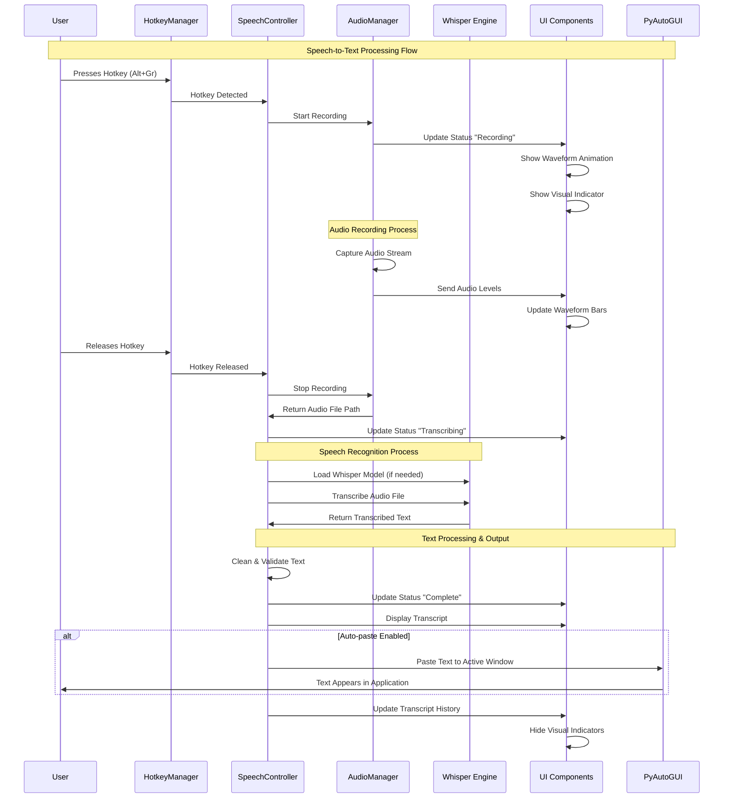
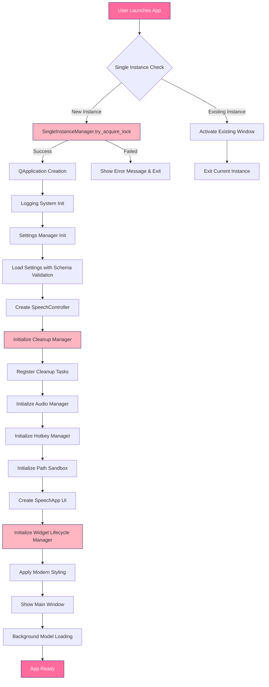

# Whiz Voice-to-Text Application Architecture & Speech Processing Flow

## Application Overview Diagram

```mermaid
graph TB
    subgraph "User Interface Layer"
        A["SpeechApp<br/>Main Application Window"]
        B["Custom Title Bar<br/>Windows Only"]
        C["Tab Widget<br/>Main Content Area"]
        D["Record Tab<br/>Recording Interface"]
        E["Transcripts Tab<br/>History Display"]
        F["Preferences Dialog<br/>Settings Window"]
        G["Waveform Widget<br/>Audio Visualization"]
        H["Visual Indicator<br/>Floating Status"]
        I["Mic Circle Widget<br/>Recording Animation"]
    end
    
    subgraph "Core Application Layer"
        J["SpeechController<br/>Main Logic Controller"]
        K["SettingsManager<br/>Configuration"]
        L["HotkeyManager<br/>Global Hotkeys"]
        M["AudioManager<br/>Audio Recording"]
        N["CleanupManager<br/>Resource Management"]
        O["SingleInstanceManager<br/>Prevent Multiple Instances"]
    end
    
    subgraph "Security & Validation"
        P["FileSandbox<br/>Path Validation"]
        Q["TranscriptionExceptions<br/>Error Handling"]
        R["PathValidator<br/>Secure Operations"]
    end
    
    subgraph "External Dependencies"
        S["Whisper Engine<br/>Speech Recognition"]
        T["SoundDevice<br/>Audio Recording"]
        U["PyAutoGUI<br/>Text Pasting"]
        V["PyInput<br/>Hotkey Detection"]
        W["PyQt5<br/>GUI Framework"]
    end
    
    %% UI Connections
    A --> B
    A --> C
    C --> D
    C --> E
    A --> F
    D --> G
    D --> I
    A --> H
    
    %% Core Connections
    A --> J
    A --> K
    J --> L
    J --> M
    J --> N
    A --> O
    
    %% Security Connections
    J --> P
    J --> Q
    P --> R
    
    %% External Connections
    M --> T
    J --> S
    J --> U
    L --> V
    A --> W
    
    %% Styling
    classDef uiClass fill:#e1f5fe,stroke:#01579b,stroke-width:2px
    classDef coreClass fill:#f3e5f5,stroke:#4a148c,stroke-width:2px
    classDef securityClass fill:#fff3e0,stroke:#e65100,stroke-width:2px
    classDef externalClass fill:#e8f5e8,stroke:#2e7d32,stroke-width:2px
    
    class A,B,C,D,E,F,G,H,I uiClass
    class J,K,L,M,N,O coreClass
    class P,Q,R securityClass
    class S,T,U,V,W externalClass
```

## Speech Processing Flow Diagram

## Detailed Speech Processing Pipeline

```mermaid
graph LR
    subgraph "Audio Input"
        A["Microphone Input"] --> B["SoundDevice Stream"]
        B --> C["Audio Chunks<br/>Thread-Safe Queue"]
    end
    
    subgraph "Real-time Processing"
        C --> D["Audio Level Calculation<br/>RMS Analysis"]
        C --> E["Audio Frame Storage"]
        D --> F["Waveform Widget<br/>Visual Feedback"]
    end
    
    subgraph "Recording Management"
        E --> G["Device Validation<br/>Connection Check"]
        G -->|Valid| H["Continue Recording"]
        G -->|Invalid| I["Fallback Device"]
        I --> H
    end
    
    subgraph "File Processing"
        H --> J["Audio File Creation<br/>Sandboxed WAV"]
        J --> K["Model Loading Check<br/>Thread-Safe"]
        K --> L["Whisper Model<br/>Background Loading"]
    end
    
    subgraph "Speech Recognition"
        L --> M["Speech Recognition<br/>With Retry Logic"]
        M --> N["Exception Classification<br/>Error Handling"]
        N -->|Success| O["Text Processing<br/>Cleanup & Validation"]
        N -->|Retry| P["Exponential Backoff"]
        N -->|Failure| Q["Error Recovery"]
    end
    
    subgraph "Output & Storage"
        O --> R["Transcript Storage<br/>Timestamp & Text"]
        R --> S["UI Update<br/>Safe Widget Access"]
        O --> T["PyAutoGUI<br/>Paste to Active Window"]
    end
    
    %% Styling
    classDef inputClass fill:#e3f2fd,stroke:#1976d2,stroke-width:2px
    classDef processClass fill:#f3e5f5,stroke:#7b1fa2,stroke-width:2px
    classDef outputClass fill:#e8f5e8,stroke:#388e3c,stroke-width:2px
    classDef errorClass fill:#ffebee,stroke:#d32f2f,stroke-width:2px
    
    class A,B,C inputClass
    class D,E,F,G,H,I,J,K,L,M processClass
    class O,R,S,T outputClass
    class N,P,Q errorClass
```

## Application Startup Flow

## Key Features

### UI Components
- **SpeechApp**: Main application window with custom title bar (Windows)
- **Record Tab**: Recording interface with animated microphone circle and waveform
- **Transcripts Tab**: History of all transcribed text with timestamps
- **Waveform Widget**: Real-time audio visualization with neon effects
- **Visual Indicator**: Floating status indicator showing recording state
- **Preferences Dialog**: Comprehensive settings management

### Core Functionality
- **Hotkey-based Recording**: Global hotkey (Alt+Gr) for hands-free operation
- **Real-time Audio Visualization**: Animated waveform showing audio levels
- **Background Model Loading**: Non-blocking Whisper model initialization
- **Auto-paste**: Optional automatic text insertion into active applications
- **Device Management**: Automatic audio device detection and fallback
- **Error Handling**: Comprehensive exception handling with retry logic

### Security & Performance
- **File Sandboxing**: Secure temporary file handling
- **Single Instance**: Prevents multiple application instances
- **Resource Cleanup**: Ordered cleanup system for proper resource management
- **Thread Safety**: Thread-safe audio processing and UI updates
- **Performance Monitoring**: Built-in performance tracking and optimization
