# Whiz Voice-to-Text Application Architecture

This document provides comprehensive architectural diagrams and documentation for the Whiz Voice-to-Text application. The diagrams are automatically generated and should be updated whenever significant changes are made to the codebase.

## 📋 Table of Contents

1. [Application Startup Flow](#1-application-startup-flow)
2. [Core Architecture Components](#2-core-architecture-components)
3. [Recording and Transcription Flow](#3-recording-and-transcription-flow)
4. [UI Component Hierarchy](#4-ui-component-hierarchy)
5. [Settings Management System](#5-settings-management-system)
6. [Modern Styling System](#6-modern-styling-system)
7. [Audio Processing Pipeline](#7-audio-processing-pipeline)
8. [Threading and Signal Architecture](#8-threading-and-signal-architecture)
9. [Single Instance Management](#9-single-instance-management)
10. [Resource Cleanup System](#10-resource-cleanup-system)
11. [Error Handling and Exception Management](#11-error-handling-and-exception-management)
12. [Security and Path Validation](#12-security-and-path-validation)

## 🎯 Architecture Overview

The Whiz application follows a modern, modular architecture with clear separation of concerns:

- **UI Layer**: PyQt5-based interface with custom styling and widget lifecycle management
- **Core Logic**: SpeechController manages audio and transcription with enhanced error handling
- **Settings Management**: Comprehensive configuration system with schema validation and migration
- **Security Layer**: Path validation, file sandboxing, and secure operations
- **Resource Management**: Centralized cleanup system with ordered phases
- **Single Instance**: Lock file mechanism preventing multiple instances
- **External Dependencies**: Whisper, sounddevice, pynput, PyAutoGUI

---

## 1. Application Startup Flow

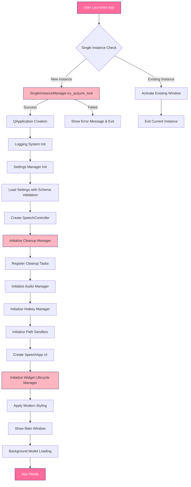

**Key Files:**
- main.py - Direct application entry point with single instance check
- core/single_instance_manager.py - Single instance prevention
- core/cleanup_manager.py - Resource cleanup management
- core/settings_schema.py - Settings validation and migration
- ui/widget_lifecycle.py - Widget lifecycle management

---

## 2. Core Architecture Components

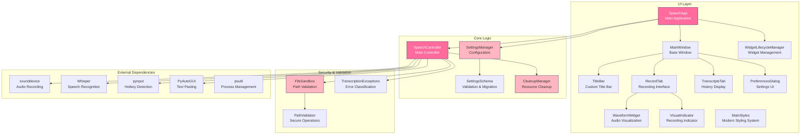

**Component Responsibilities:**
- **SpeechApp**: Main application class with widget lifecycle management
- **SpeechController**: Core audio recording and transcription logic with enhanced error handling
- **SettingsManager**: Configuration persistence with schema validation and migration
- **CleanupManager**: Centralized resource cleanup with ordered phases
- **WidgetLifecycleManager**: Safe widget access and cleanup
- **FileSandbox**: Secure file operations and path validation
- **SingleInstanceManager**: Prevents multiple application instances

---

## 3. Recording and Transcription Flow

```mermaid
graph LR
    A[Hotkey Pressed] --> B[HotkeyManager Validation]
    B --> C[AudioManager.start_recording]
    C --> D[Device Validation]
    D -->|Valid| E[Start Audio Stream]
    D -->|Invalid| F[Fallback Device]
    F --> E
    
    E --> G[Audio Callback<br/>Thread-Safe Queue]
    G --> H[Real-time Level Monitoring]
    G --> I[Frame Storage]
    
    H --> J[WaveformWidget<br/>Visual Feedback]
    
    I --> K[Hotkey Released]
    K --> L[AudioManager.stop_recording]
    L --> M[Collect Audio Frames]
    
    M --> N[Save to Sandboxed File]
    N --> O[Model Loading Check]
    O -->|Not Loaded| P[Load Model with Retry]
    O -->|Loaded| Q[Transcribe Audio]
    P --> Q
    
    Q --> R[Exception Classification]
    R -->|Success| S[Process Transcript]
    R -->|Retry| T[Retry with Backoff]
    R -->|Failure| U[Error Handling]
    
    S --> V[Update UI Safely]
    V --> W[Auto-paste if Enabled]
    
    style A fill:#FF6B9D,stroke:#2D1B69,color:#fff
    style Q fill:#FF6B9D,stroke:#2D1B69,color:#fff
    style R fill:#FFB6C1,stroke:#2D1B69
    style N fill:#FFB6C1,stroke:#2D1B69
```

**Enhanced Features:**
- **Device Validation**: Automatic device health checking and fallback
- **Thread-Safe Audio**: Queue-based audio data handling
- **Exception Classification**: Specific error types with retry logic
- **Sandboxed Operations**: Secure file handling
- **Model Loading**: Background loading with proper synchronization

---

## 4. UI Component Hierarchy

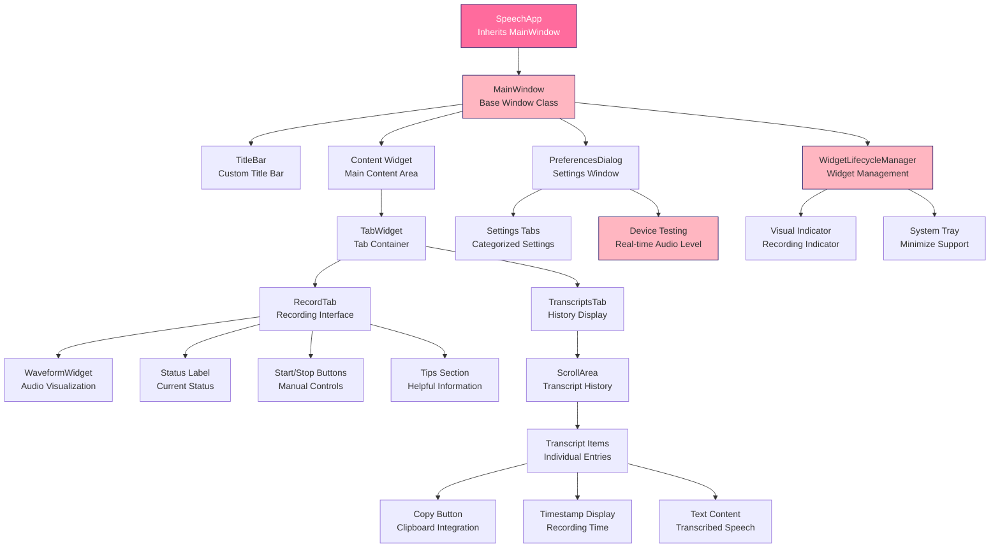

**UI Architecture:**
- **Inheritance-based**: SpeechApp extends MainWindow for base functionality
- **Widget Lifecycle Management**: Safe widget access and cleanup
- **Tab-based Interface**: Clean separation between recording and history
- **Custom Title Bar**: Modern frameless window with custom controls
- **Device Testing**: Real-time audio level testing in preferences
- **System Tray Integration**: Minimize to tray functionality

---

## 5. Settings Management System

The settings system provides comprehensive configuration management with schema validation, migration support, persistent storage, and **performance optimization through intelligent caching**.

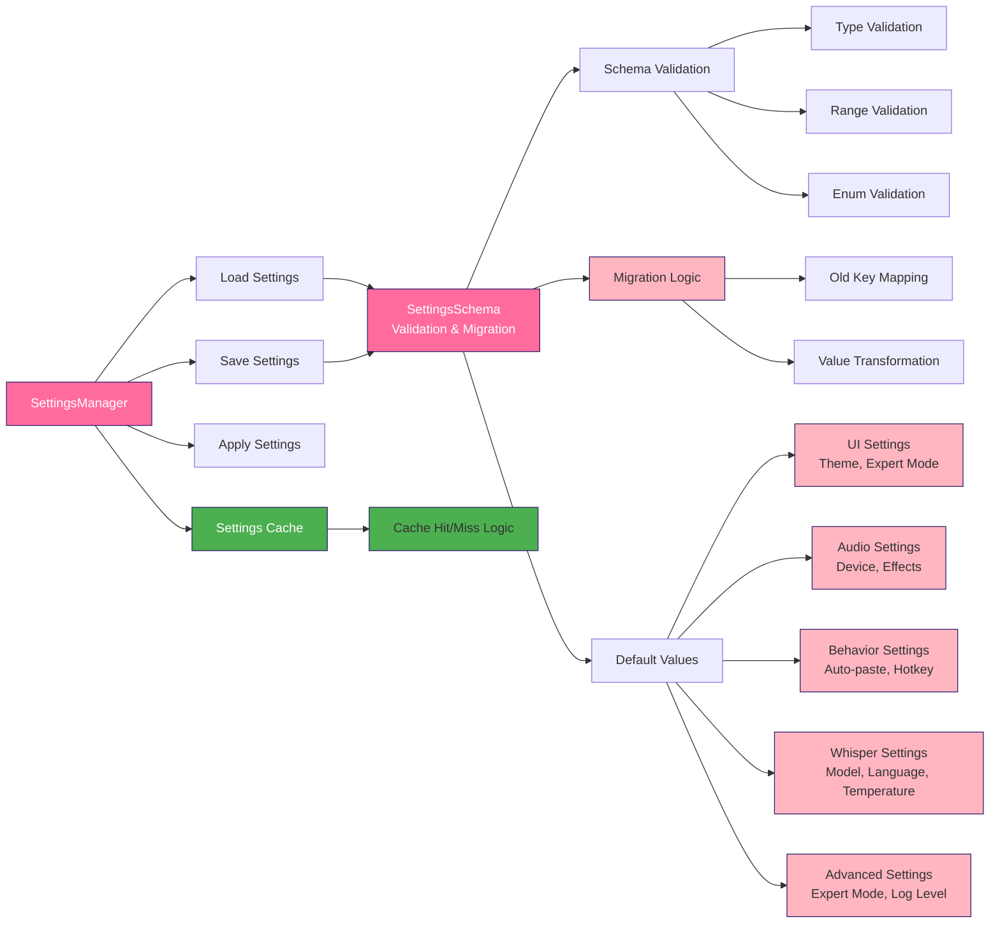

**Settings Categories:**
- **UI Settings**: Theme, expert mode, startup tab, window behavior
- **Audio Settings**: Device selection, sound effects, tone selection
- **Behavior Settings**: Auto-paste, hotkey configuration, visual indicators
- **Whisper Settings**: Model selection, language, temperature, engine
- **Advanced Settings**: Expert mode toggle, log level, performance options

**Recent Performance Improvements (v2.0):**
- ✅ **Settings Caching**: Eliminated redundant validation on repeated `load_all()` calls
- ✅ **Cache Invalidation**: Smart cache invalidation when settings change
- ✅ **Migration Consolidation**: Fixed duplicate settings keys and inconsistent naming
- ✅ **Validation UX**: User-friendly error messages for invalid settings

**Key Benefits:**
- **Faster UI**: Preferences dialog opens instantly with cached settings
- **Reduced CPU**: No redundant validation on every dialog open
- **Better UX**: Clear error messages when validation fails
- **Consistency**: Single source of truth for each setting

---

## 6. Modern Styling System

```mermaid
graph TD
    A[MainStyles Class] --> B[get_main_stylesheet<br/>Main Application Styles]
    A --> C[Component-Specific Styles]
    
    B --> D[Main Window<br/>Dark Theme Background]
    B --> E[Tab Widget<br/>Clean Obsidian Design]
    B --> F[Buttons<br/>Cyan Accents]
    B --> G[Input Fields<br/>Modern Rounded Design]
    B --> H[Scroll Areas<br/>Elegant Borders]
    
    C --> I[Status Label Style]
    C --> J[Start Button Style]
    C --> K[Stop Button Style]
    C --> L[Tips Content Style]
    C --> M[Transcript Item Style]
    C --> N[Expert Mode Styles]
    
    O[ColorTokens] --> P[Dark Theme Palette]
    O --> Q[Accent Colors]
    O --> R[Border Colors]
    O --> S[Hover States]
    
    T[LayoutTokens] --> U[Responsive Spacing]
    T --> V[Font Sizes]
    T --> W[Border Radius]
    
    style A fill:#FF6B9D,stroke:#2D1B69,color:#fff
    style B fill:#FFB6C1,stroke:#2D1B69
    style O fill:#FFB6C1,stroke:#2D1B69
    style T fill:#FFB6C1,stroke:#2D1B69
```

**Design Principles:**
- **Dark Theme**: Modern dark interface with cyan accents
- **Obsidian.io Clean**: Minimal, functional interface design
- **Responsive Design**: Adaptive spacing and font sizes
- **Consistent Spacing**: Generous padding and margins
- **Expert Mode**: Separate styling for advanced settings

---

## 7. Audio Processing Pipeline

```mermaid
graph LR
    A[Microphone Input] --> B[sounddevice Stream]
    B --> C[Audio Chunks<br/>Thread-Safe Queue]
    C --> D[Audio Level Calculation<br/>RMS Analysis]
    C --> E[Audio Frame Storage]
    
    D --> F[WaveformWidget<br/>Real-time Visualization]
    
    E --> G[Device Validation<br/>Connection Check]
    G -->|Valid| H[Continue Recording]
    G -->|Invalid| I[Fallback Device]
    I --> H
    
    H --> J[Audio File Creation<br/>Sandboxed WAV]
    J --> K[Model Loading Check<br/>Thread-Safe]
    K --> L[Whisper Model<br/>Background Loading]
    L --> M[Speech Recognition<br/>With Retry Logic]
    
    M --> N[Exception Classification<br/>Error Handling]
    N -->|Success| O[Text Processing<br/>Cleanup & Validation]
    N -->|Retry| P[Exponential Backoff]
    N -->|Failure| Q[Error Recovery]
    
    O --> R[Transcript Storage<br/>Timestamp & Text]
    R --> S[UI Update<br/>Safe Widget Access]
    
    alt Auto-paste Enabled
        O --> T[PyAutoGUI<br/>Paste to Active Window]
    end
    
    style A fill:#FF6B9D,stroke:#2D1B69,color:#fff
    style M fill:#FF6B9D,stroke:#2D1B69,color:#fff
    style N fill:#FFB6C1,stroke:#2D1B69
    style J fill:#FFB6C1,stroke:#2D1B69
    style G fill:#FFB6C1,stroke:#2D1B69
```

**Audio Processing Features:**
- **Thread-Safe Recording**: Queue-based audio data handling
- **Device Validation**: Automatic health checking and fallback
- **Sandboxed File Operations**: Secure temporary file handling
- **Background Model Loading**: Non-blocking Whisper model loading
- **Exception Handling**: Comprehensive error classification and retry logic
- **Real-time Visualization**: Enhanced waveform with neon effects

---

## 8. Threading and Signal Architecture

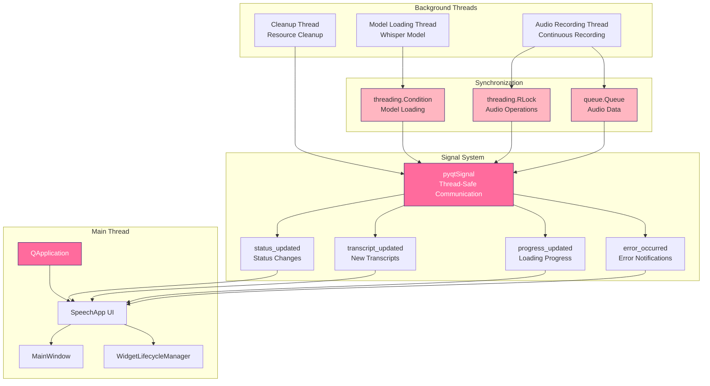

**Threading Strategy:**
- **Main Thread**: UI updates and user interactions
- **Background Threads**: Heavy operations (model loading, audio, cleanup)
- **Thread-Safe Communication**: PyQt signals for UI updates
- **Synchronization**: Proper locking and condition variables
- **Resource Management**: Ordered cleanup with verification

---

## 9. Single Instance Management

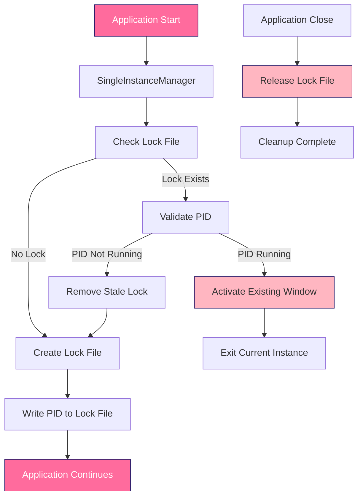

**Single Instance Features:**
- **Lock File Mechanism**: PID-based lock file creation
- **Process Validation**: Verify PID is still running
- **Window Activation**: Bring existing instance to front
- **Stale Lock Cleanup**: Remove locks from crashed instances
- **Cross-Platform Support**: Works on Windows, macOS, and Linux

---

## 10. Resource Cleanup System

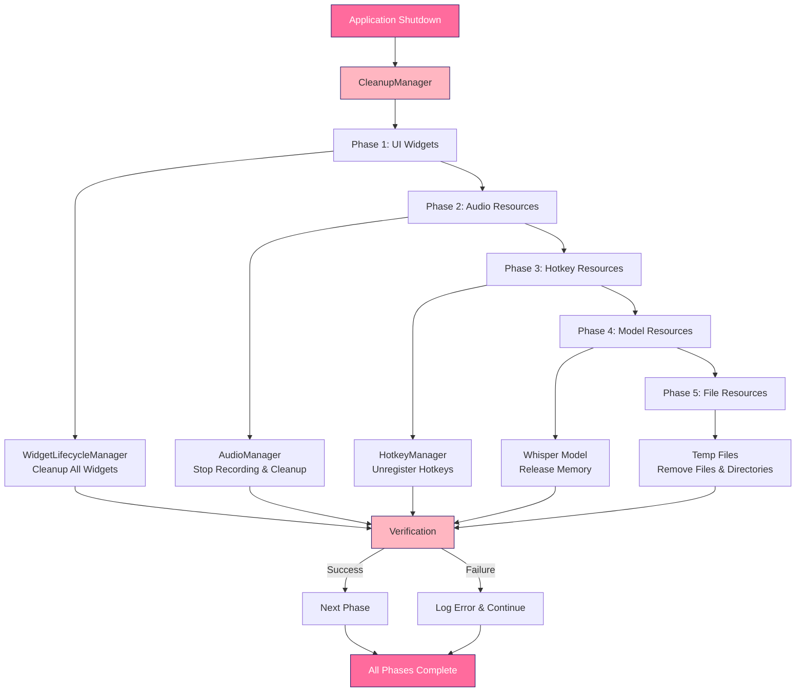

**Cleanup Features:**
- **Ordered Phases**: UI → Audio → Hotkeys → Model → Files
- **Verification**: Confirm cleanup was successful
- **Timeout Protection**: Prevent hanging during cleanup
- **Critical vs Non-Critical**: Distinguish essential cleanup tasks
- **Error Handling**: Continue cleanup even if some tasks fail

---

## 11. Error Handling and Exception Management

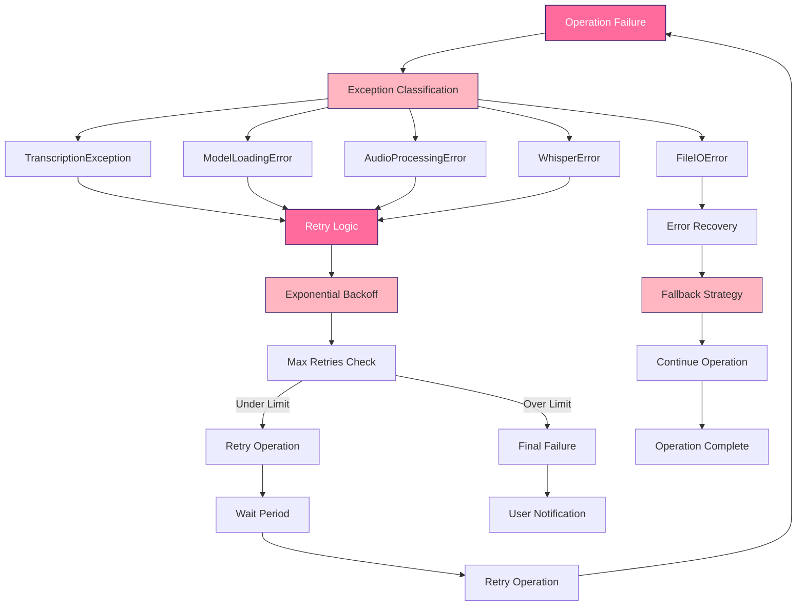

**Exception Types:**
- **TranscriptionException**: Base class for all transcription errors
- **ModelLoadingError**: Whisper model loading failures
- **AudioProcessingError**: Audio recording and processing issues
- **FileIOError**: File system and I/O operations
- **WhisperError**: Whisper-specific transcription errors
- **TranscriptionTimeoutError**: Timeout during transcription

---

## 12. Security and Path Validation

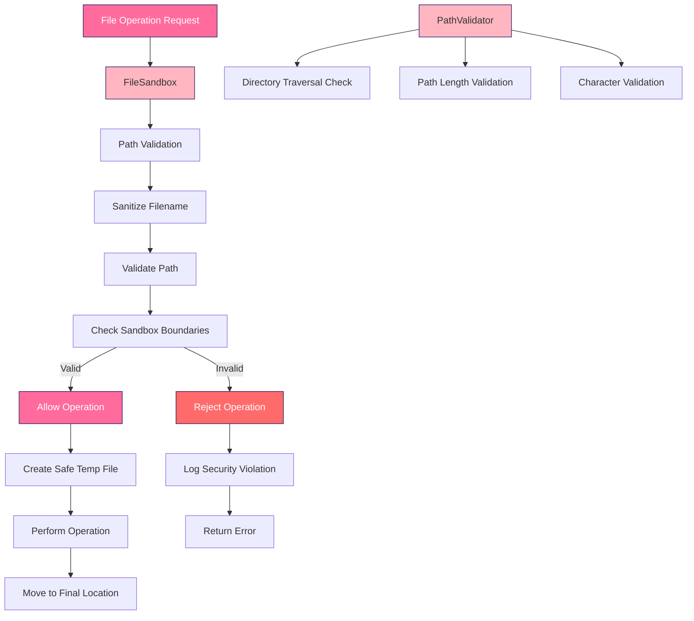

**Security Features:**
- **Path Sanitization**: Clean and validate file paths
- **Sandboxing**: Restrict operations to safe directories
- **Directory Traversal Protection**: Prevent path traversal attacks
- **Temporary File Management**: Secure temporary file creation
- **Boundary Checking**: Ensure operations stay within allowed areas

---

## 🔄 Keeping Diagrams Up-to-Date

### When to Update Diagrams

Update these diagrams when making changes to:

1. **Architecture Changes**: New components, major refactoring
2. **UI Modifications**: New tabs, significant layout changes
3. **Settings System**: New settings categories or validation rules
4. **Audio Pipeline**: Changes to recording or processing logic
5. **Threading Model**: New background processes or signal patterns
6. **Security Features**: New validation or sandboxing mechanisms
7. **Error Handling**: New exception types or retry logic
8. **Resource Management**: Changes to cleanup phases or verification

### How to Update

1. **Edit this file**: Update the relevant Mermaid diagram
2. **Test the diagram**: Use a Mermaid viewer to verify syntax
3. **Update related documentation**: Ensure other docs reflect changes
4. **Commit with clear message**: Include "docs: update architecture diagrams"

### Tools for Diagram Maintenance

- **Mermaid Live Editor**: https://mermaid.live/
- **VS Code Mermaid Extension**: For local editing
- **GitHub Mermaid Support**: Automatic rendering in markdown

---

## 📚 Related Documentation

- [README.md](../../README.md) - Project overview and setup
- [QUICK_START.md](../guides/QUICK_START.md) - Getting started guide
- [CHANGES_DOCUMENTATION.md](../release/CHANGES_DOCUMENTATION.md) - Recent changes and improvements
- [WAVEFORM_ANIMATION_IMPLEMENTATION.md](../guides/WAVEFORM_ANIMATION_IMPLEMENTATION.md) - Waveform details
- [CUSTOM_TITLEBAR_README.md](../guides/CUSTOM_TITLEBAR_README.md) - Title bar implementation

---

*Last Updated: December 2024*
*Version: 2.0 - Major Architecture Update*